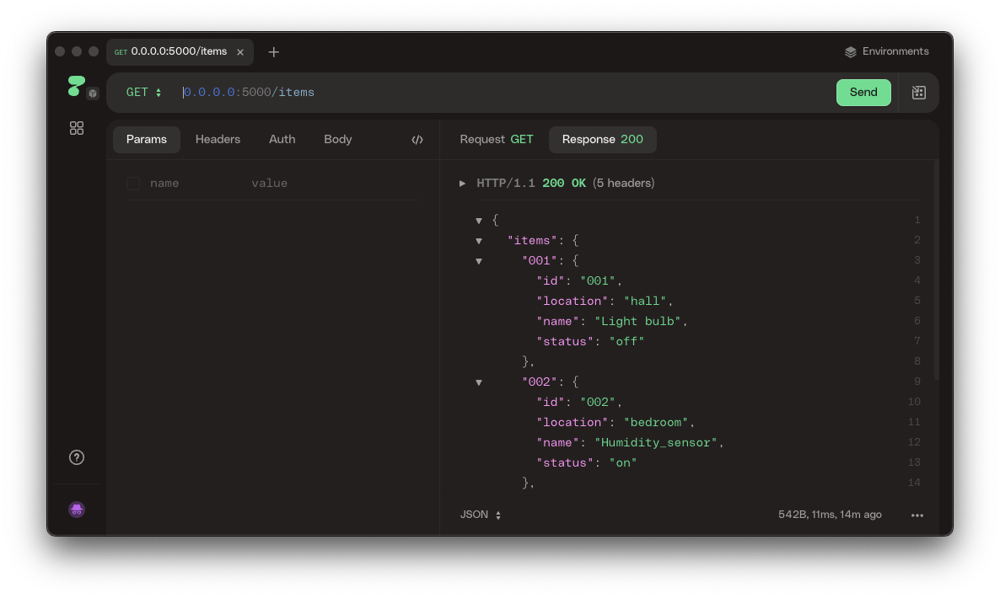
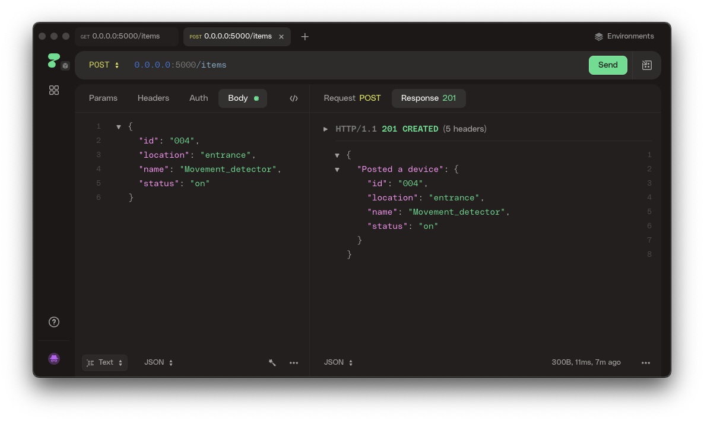

Developers need to test their APIs. There are plenty of tools for these tasks, allowing you to send a wide variety of HTTP, REST, and other requests. For example, [Postman](https://www.postman.com/) or the integrated [HTTP Client](https://www.jetbrains.com/help/pycharm/http-client-in-product-code-editor.html) in PyCharm Professional. 

In this task, we will use the open-source tool [HTTPie](https://httpie.io). All such applications are similar in some way, so you can use HTTPie or any other tool by analogy.

You can download and install a desktop version of HTTPie [here](https://httpie.io/desktop).

### GET request
As with all such programs, the interface allows you to specify the query type, parameters, headers, authorization type, and more. For the very first request, we only need to specify the URL `http://0.0.0.0:5000/items` and press the **Send** button.

Remember to launch our Flask application beforehand!

HTTPie automatically detects the language of the response, links, and formats text inside the body to make inspection easy.

### POST request
Next, create a POST request. To do this, specify the `POST` request type, the URL `http://0.0.0.0:5000/items`, and the Body of the request. Select `Text` as the Body type.

After executing the request, you should get a response containing the request body.

### Explore your app
Check that all the other methods defined in your API work as expected (getting a specific device, deleting a device, updating a device).
