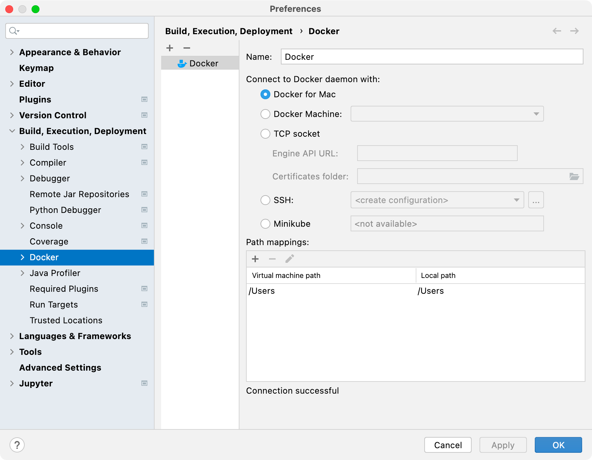
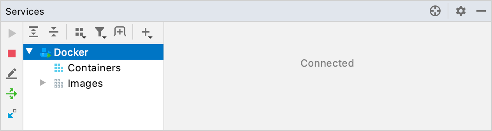

Running the app as described before works just fine, but it assumes you have the Python environment set up correctly. We can avoid this issue by running the application in a **Docker container**.

### Docker Containers

Docker containers provide code isolation, independence, and portability. Docker is essentially needed 
if one intends to deploy their application into production. Docker containers have fully prescribed 
dependencies with which they can be created. These dependencies as well as the instruction on how 
specifically to create the container are stored in the container’s **image**.

A **Dockerfile** is basically a set of instructions for building a container image, which is a blueprint that your container will run off of.

Read more about Docker in [Docker docs](https://docs.docker.com/).

### Enable Docker support in IntelliJ IDEA

1. Install and run Docker. For more information, see the Docker documentation.

2. Configure the Docker daemon connection settings:

a) Press ⌘, to open the IDE settings and select **Build, Execution, Deployment | Docker**.

b) Click **+** to add a Docker configuration and specify how to connect to the Docker daemon.

The connection settings depend on your Docker version and operating system. For more information, see [Docker configuration](https://www.jetbrains.com/help/idea/docker-connection-settings.html).

The **Connection successful** message should appear at the bottom of the dialog.

3. Connect to the Docker daemon.
   The configured Docker connection should appear in the Services tool window (**View | Tool Windows | Services** or ⌘8). Select the Docker node  and click , or select **Connect** from the context menu.

To edit the Docker connection settings, select the Docker node and click  on the toolbar, or select **Edit Configuration** from the context menu.
