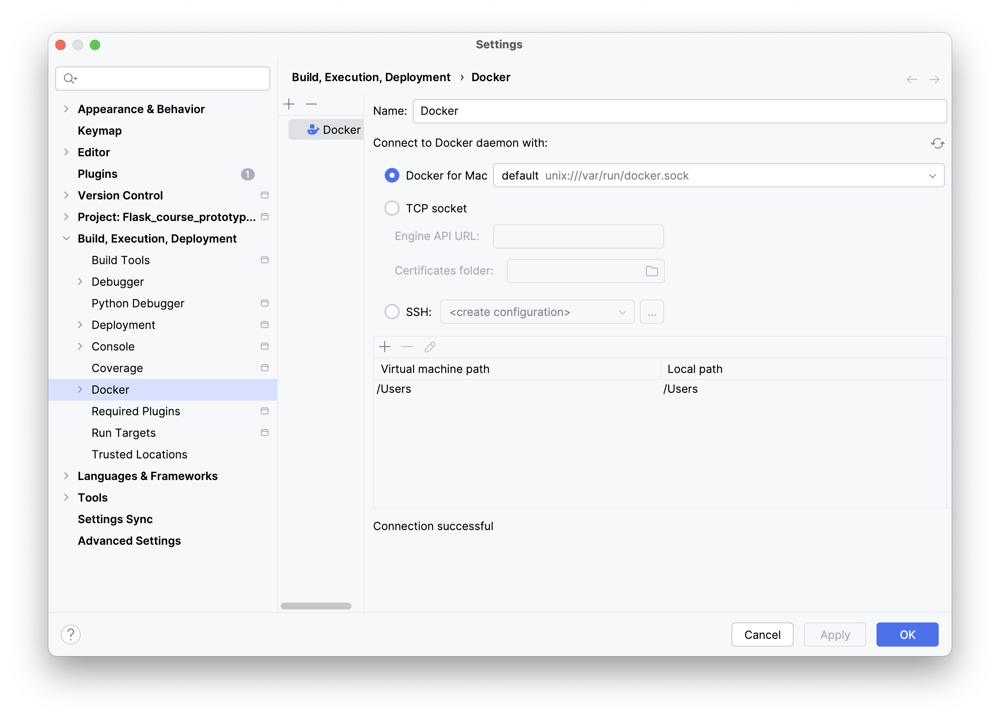
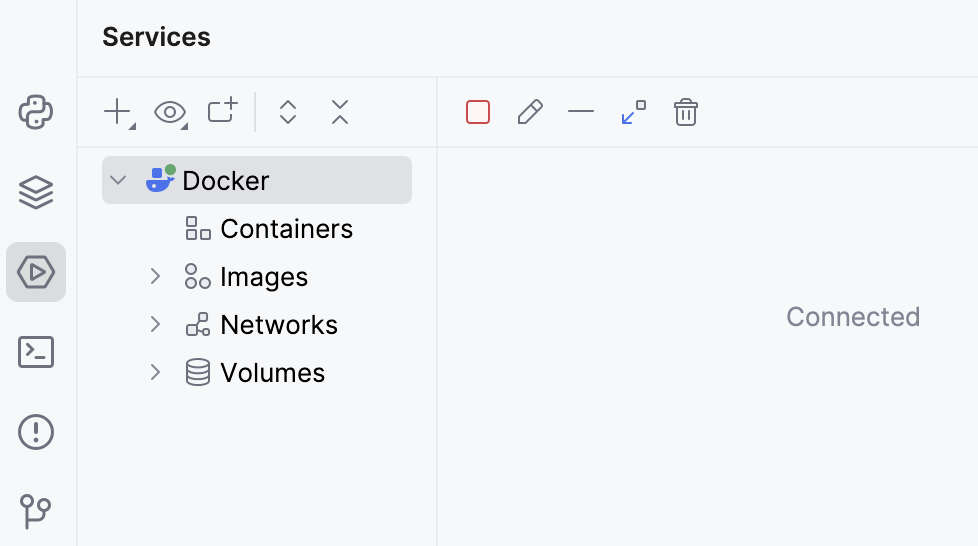

Running the app as described before works just fine, but it assumes you have the Python environment set up correctly. We can avoid this issue by running the application in a **Docker container**.

### Docker Containers
Docker containers provide code isolation, independence, and portability. Docker is essentially needed 
if one intends to deploy their application into production. Docker containers have fully prescribed 
dependencies with which they can be created. These dependencies, as well as the instructions on how 
to create the container, are stored in the container’s **image**.

A **Dockerfile** is basically a set of instructions for building a container image, which is a blueprint that your container will run from.

Read more about Docker in [Docker docs](https://docs.docker.com/).

### Docker support in JetBrains IDEs
JetBrains IDEs allow you to manage Docker containers using a graphical interface. Only a few simple steps are required to set this up.

### 1. Install and run Docker
For more information, see the [Docker documentation](https://docs.docker.com/engine/install/) specific to your operating system.

### 2. Configure the Docker daemon connection settings

1. Open the IDE settings (you can use the shortcut &shortcut:ShowSettings;) and select **Build, Execution, Deployment | Docker**.
2. Click  to add a Docker configuration and specify how to connect to the Docker daemon.  
    The connection settings depend on your Docker version and operating system. For more information, see [Docker configuration](https://www.jetbrains.com/help/pycharm/settings-docker.html).  
    The **Connection successful** message should appear at the bottom of the dialog.  
    

### 3. Connect to the Docker daemon
The configured Docker connection should appear in the Services tool window (**View | Tool Windows | Services** or &shortcut:ActivateServicesToolWindow;). Select the Docker node  and click , or select **Connect** from the context menu. Once connected, it will look like this:

To edit the Docker connection settings, select the Docker node and click  on the toolbar, or select **Edit Configuration** from the context menu.

