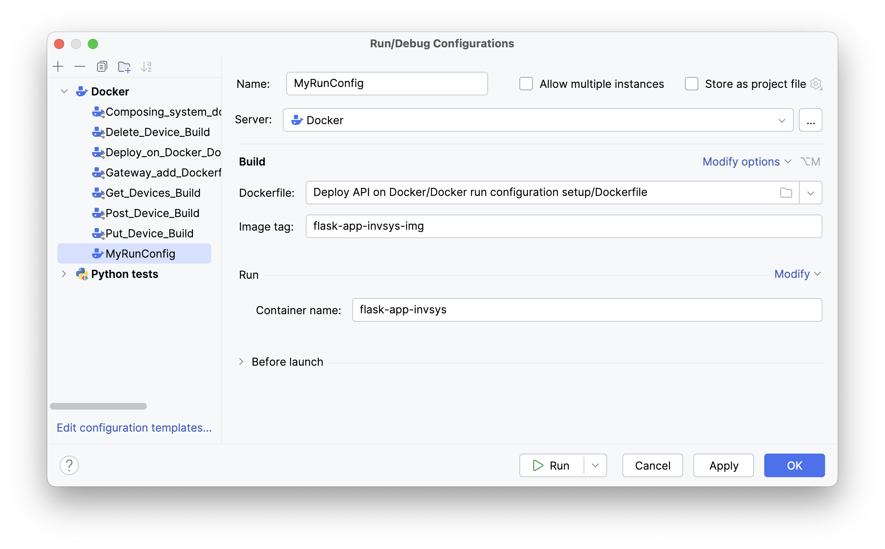
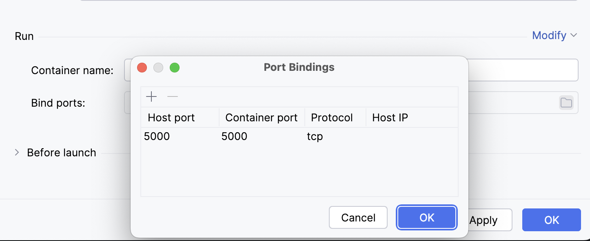
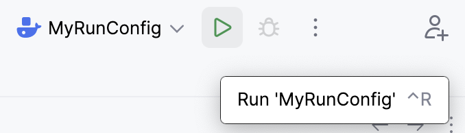
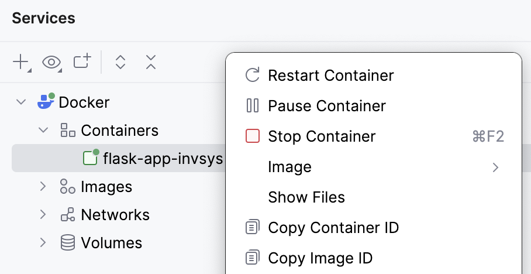
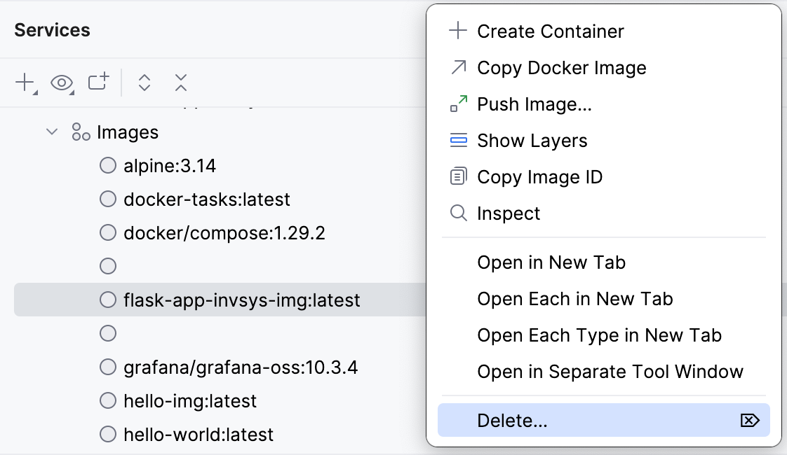

So, by now, we know that to run our solution in a container, we need to:
- Build an image according to the Dockerfile.
- Start the container from this image.
- Bind the container's port to our host machine's port so that we can access our application in the container.

The course checking system handles all of this for you, but let's also learn how to do it ourselves.
This is not difficult at all, as all these actions can be delegated to the IDE.

[Run configurations](https://www.jetbrains.com/help/pycharm/run-debug-configuration.html) are specially designed for these tasks. They allow describing exactly how to run an application and specifying various launch parameters. In this lesson, we will focus only on [Docker run configurations](https://www.jetbrains.com/help/pycharm/docker-run-configurations.html).

**Note: In this course, do not remove or modify run configurations that you didn't create on your own!**

### Create Docker run configuration
- From the main menu, select **Run | Edit Configurations…**
- In the opened **Run/Debug Configurations** window, click , select **Docker**, and then select the **Dockerfile** configuration.
- Specify the name of your configuration. It can be anything you like; we chose `MyRunConfig`.
- Specify the path to the required `Dockerfile`. This will be the path to the `Dockerfile` for this lesson.
- Add the **Image tag** and the **Container name**. Please use `flask-app-invsys-img` and `flask-app-invsys`, respectively.

- Next, click **Modify** and select **Bind ports**.
- In the **Bind ports:** field that appears, click on  to open the **Port Bindings** window.
- Click  and add the ports to be bound. 
- In our case, add `5000` to both **Host port** and **Container port**. Leave everything else as is.

- Click **OK** two times to save your port binding and run configuration!

### Launch your configuration
In the upper right corner of the IDE, select your run configuration from the list if it is not already selected. Afterward, click on  or use the shortcut &shortcut:Run; to run your configuration.

Now, after you run the Dockerfile, you should be able to access your app via http://0.0.0.0:5000/items. 
Otherwise, you will get a "Connection refused" error.

### Shut down your configuration
To stop your Docker container, just open the panel [Services](tool_window://Services) (or use the shortcut &shortcut:ActivateServicesToolWindow;), right-click the container, and select **Stop Container**. From this context menu, you can also delete the container using the **Delete...** option. This will delete only the container — no local files will be deleted.

### Don't forget
A Docker image contains application code, libraries, tools, dependencies, and other files needed to run your application.
When your application does not work as expected and you find an error, correcting it in your project will not save this change to the image you previously created and ran. You should delete an old
Docker image and rebuild it after fixing the problem.

You can also delete your image from the [Services](tool_window://Services) panel:

