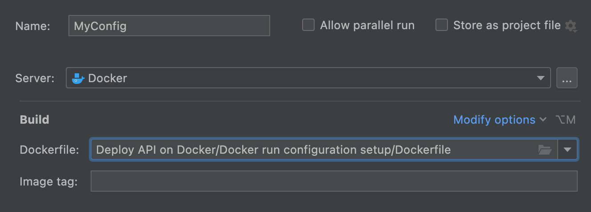
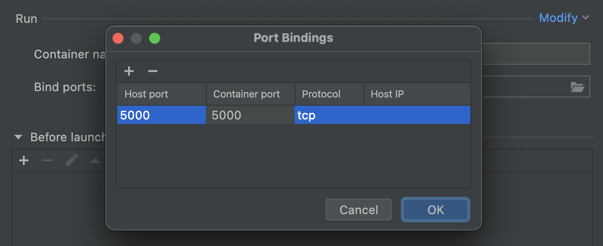

## Docker run configuration setup

Another caveat: to connect to the application running in a container, you need to 	
map specific container ports to specific ports on the host. In the previous task, this setup was already done for you. 
To do it yourself, you need to:

- From the main menu, select **Run | Edit Configurations**.
- In the **Run/Debug Configurations dialog**, click **+**, select **Docker**, and then select the **Dockerfile** configuration.
- In **Build**, select the correct Dockerfile path.

- Then click **Modify** and select **Bind ports**.
- In **Bind ports**, click the folder symbol, and in the window that opens (Port Bindings), click **+** and add 
the ports to be bound. In our case, add `5000` to both Host post and Container port. Leave everything else as is.

- Add the name of the container and image tag. Please use "flask-app-invsys" and "flask-app-invsys-img" respectively.
- Click **Ok** two times.

Now, if you run the Dockerfile, you should be able to access your app via `http://0.0.0.0:5000/items`. 
Otherwise, you will get a "Connection refused" error.
