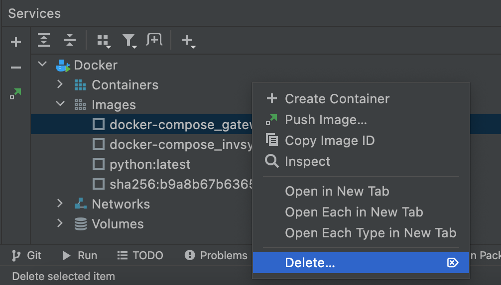

## requirements.txt and Dockerfile

### requirements.txt
As we discussed earlier, the list of packages needed for our application can be placed in a `requirements.txt` file,
which can then be committed to version control and shipped as part of an application.
Users can then install all the necessary packages with `pip install -r requirements.txt`. In our case, Docker will be installing the packages.
At this stage, you need to add `Flask` and `flask-restful` to the file.

### Dockerfile

In order to deploy this microservice API to a docker container we will first need to create a Dockerfile in the project directory.
A Dockerfile is in essence a set of instructions for building an Image which is a blueprint for our container to run off of.
Lets go over this line by line.

```text
FROM python:3.10
COPY requirements.txt /
RUN pip install -r /requirements.txt
COPY . /app
WORKDIR /app
EXPOSE 5000
CMD [ "python", "api.py" ]
```

The line `FROM python:3.10` uses the python 3.10 image from Docker Hub as our base image, This makes sure we have Python 
and all of its dependencies on the container
We `COPY requirements.txt /` which makes the file available in our docker image, and then install it using 
`RUN pip install -r /requirements.txt`. We then copy the rest of our source code into a subdirectory called app with 
`COPY . /app`. Using `WORKDIR /app` means the next commands will be executed in that directory. We `EXPOSE 5000` to expose 
port 5000, which is the port defined in our `application.py`. Then finally we state the command to run the application, 
which is `CMD [ "python", "application.py" ]`.

Add these lines to the empty Dockerfile that already exists in the project.

To run your app and see if it works, press Check.

**Be careful**, a Docker image contains application code, libraries, tools, dependencies and other files needed to make your application run.
When your application does not work as expected, you find an error and correct it in your project,
this change will not be saved to the image you previously created and run. You should delete all old
Docker container images and build them again after you fix the problem. 




