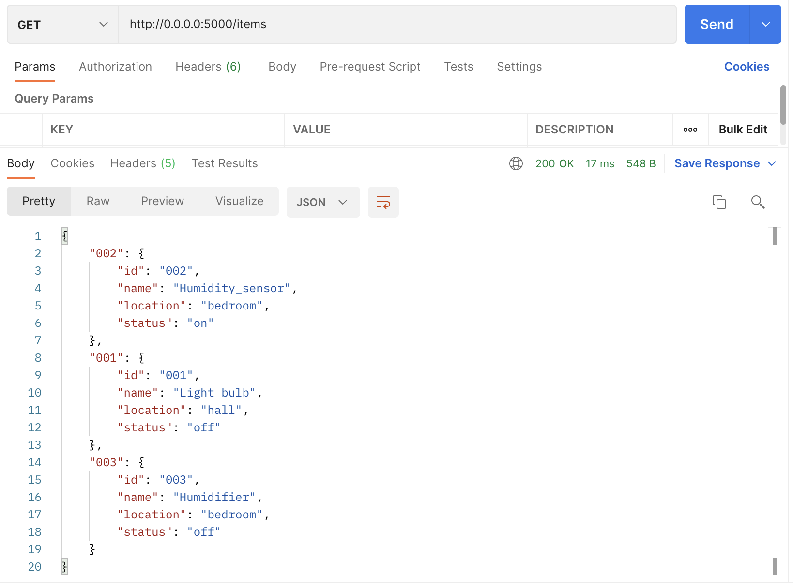

## What is Postman?
[Postman](https://www.postman.com/) is an API platform for developers to design, build, test and iterate their APIs. We are going to be using the Postman API client to test our API.

The Postman API client is the foundational tool of Postman, and it enables you to easily explore, debug, and test your APIs while also enabling you to define complex API requests for HTTP, REST, SOAP, GraphQL, and WebSockets.

The API client automatically detects the language of the response, links, and format text inside the body to make inspection easy. The client also includes built-in support for authentication protocols like OAuth 1.2/2.0, AWS Signature, Hawk, and many more.

You can download Postman from [here](https://www.postman.com/downloads/).

## Testing the app

1. Open Postman and send a `GET` request to `http://0.0.0.0:5000/items`. You should see a response:

2. `POST` a new device instance to `http://0.0.0.0:5000/items`, you should get a response containing the request body.

3. Check that all the other methods defined in your API work as expected (getting a specific device, deleting a device, updating a device).