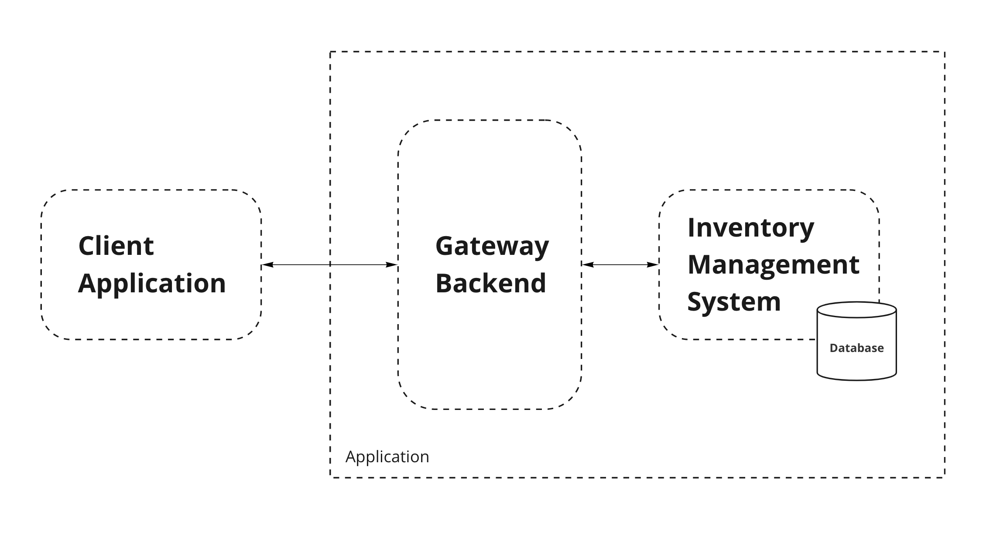
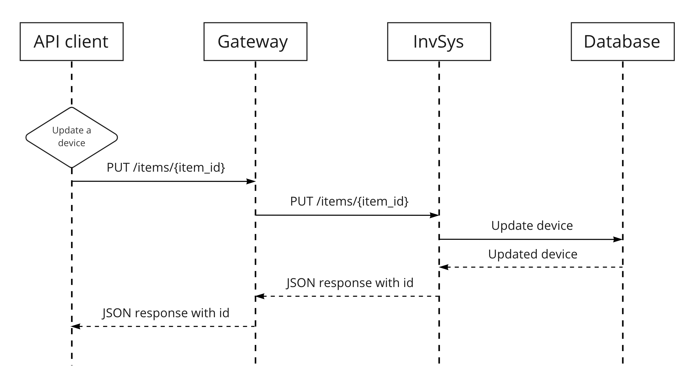

### What are microservices?

Microservices are an architectural and organizational approach to software development where software is composed of small, independent services.
In monolithic architectures, all processes are tightly coupled and run as a single service.
Adding or improving features in a monolithic application becomes more complex as the code base grows. 
This limits scalability and makes it difficult to implement new ideas. 

With a microservice architecture, an application is built as independent components, each performing a single function and
communicating with each other over lightweight APIs. 
Each component service in a microservice architecture can be developed, deployed, operated, and scaled without affecting the functioning of other services. 

### What will we build?

We intend to create a backend application consisting of multiple microservices.
We'll build a simple API that performs basic CRUD operations on a database of smart home devices. For simplicity, we will
use persistent data storage instead of a real database solution.
An additional component will be an API gateway backend, which acts as a router and authorizer of client requests.
This means our application will consist of two backend components: one being the inventory manager and the other being the API gateway.
The application will expose a RESTful interface.

### System definition

Before starting, we should define our system to some extent and determine how we expect the user to interact with it. We do this using UML diagrams and sequence diagrams, respectively.

#### UML:
We can describe our system with the following diagram. It allows us to visualize each component and the respective links between them. The UML doesn't specify anything about the content of the interfaces.

#### Sequence diagram

We can describe how the API client interacts with our system using the sequence diagram below.

### Development
We will start by developing the inventory management application and then work outwards to the gateway system. So the development will proceed a follows:

Inventory management flask app -> API gateway application -> Combined deployment.
