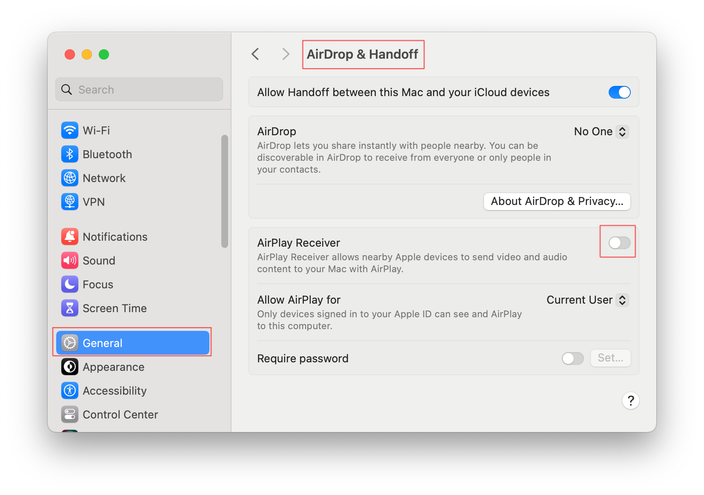

Before we get started, let's make sure there's nothing in our way. To run the applications in the course, we will need ports `5000` and `5001`. Let's make sure they are not in use.

To do this, press the **Check** button. Successfully passed tests will mean that there are no conflicts.

For Windows and Linux, we almost certainly won't have any conflicts. But for macOS, there might be a problem with port `5000`.

### Disabling AirPlay Receiver for macOS
It's not only Flask that uses port `5000` by default. AirPlay uses it as well. To disable AirPlay on your Mac, turn off the `AirPlay Receiver` switch in the macOS settings:  

You'll be able to turn it back on at any time after you finish the course.
